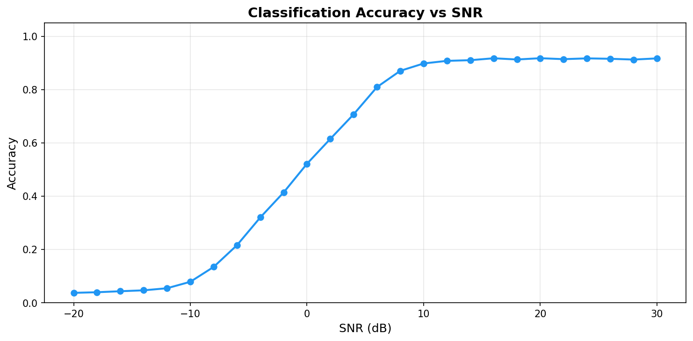
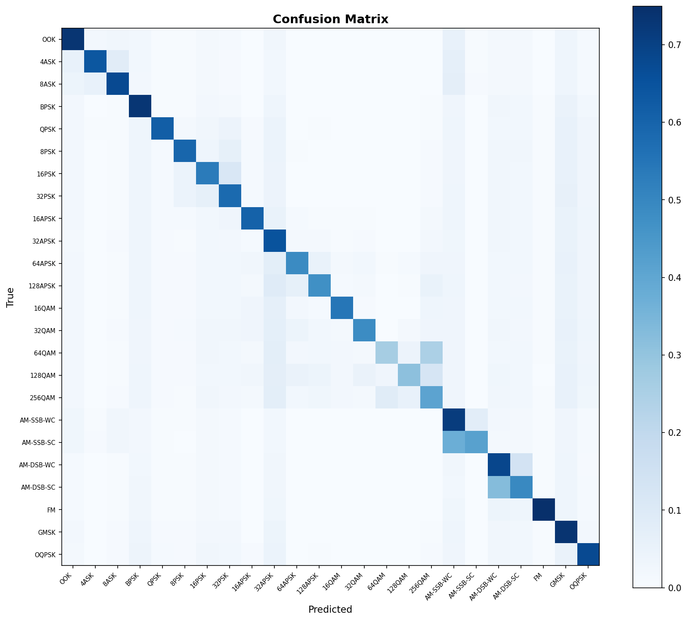
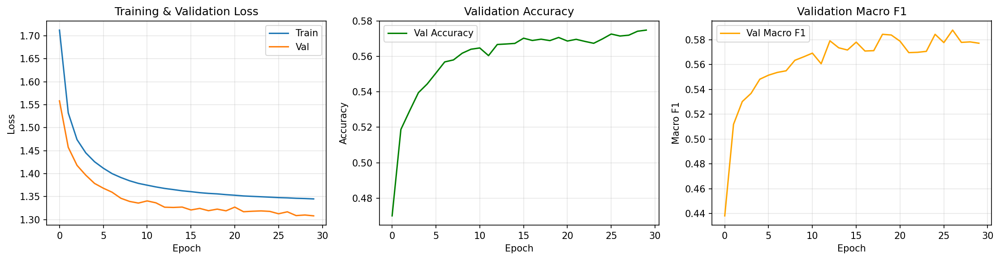
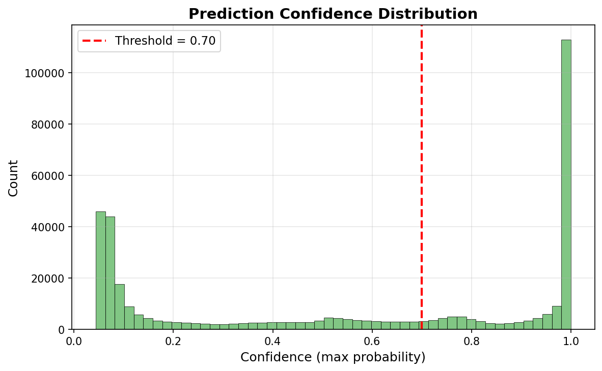

# RF-Sentinel

**Robust RF Modulation Recognition from Raw I/Q Data**

RF-Sentinel is a research-oriented RF signal analysis framework for automatic modulation classification (AMC). It provides a complete, reproducible pipeline from raw I/Q data to trained deep learning models with comprehensive evaluation, confidence-aware inference, and experiment tracking.

---

## What This Project Does

- **Loads and inspects** the DeepSig RadioML 2018.01A dataset (HDF5 format)
- **Preprocesses** raw I/Q samples with per-sample RMS normalization
- **Uses lazy HDF5 reads** for full RadioML runs so the 20+ GB `X` array is not duplicated in RAM
- **Trains** raw-waveform PyTorch classifiers for 24 modulation types: CNN1D, ResNet1D, and TCN1D / dilated CNN
- **Tracks experiments** with MLflow (parameters, metrics, artifacts)
- **Evaluates** with overall accuracy, macro/weighted F1, per-class metrics, confusion matrix, and accuracy vs. SNR curves
- **Analyzes robustness** across SNR regimes: low-SNR failure analysis, class-pair confusion, degradation reports
- **Provides confidence-aware inference**: softmax confidence, top-k predictions, accepted/uncertain decisions
- **Includes** a Streamlit research demo for single-sample inspection
- **Supports** an optional XGBoost baseline on engineered I/Q features

## What This Project Does NOT Do

- **Does not include the dataset** — you must download RadioML 2018.01A separately
- **Does not validate on real SDR hardware** — all experiments use synthetic/simulated data
- **Does not implement real-time streaming** in v1 — this is a batch research pipeline
- **Does not implement ONNX export, FastAPI, or Docker Compose** — these are planned for v2

---

## Project Architecture

```
RF-Sentinel/
├── configs/                    # YAML configuration files
├── data/raw/                   # Place RadioML HDF5 here (not committed)
├── src/rf_sentinel/            # Main Python package
│   ├── config/                 # Configuration loader
│   ├── data/                   # Dataset loading, preprocessing, splits
│   ├── signal/                 # I/Q feature extraction
│   ├── models/                 # CNN1D, ResNet1D, TCN1D & XGBoost models
│   ├── training/               # Training loop, losses, MLflow
│   ├── evaluation/             # Metrics, plots, robustness, error analysis
│   ├── inference/              # Confidence-aware predictor
│   ├── utils/                  # Logging, seeds, paths, device
│   └── cli.py                  # Typer CLI entry point
├── app/                        # Streamlit research demo
├── tests/                      # Pytest tests (no real dataset needed)
├── docs/                       # Documentation
├── reports/                    # Generated reports & figures
└── artifacts/                  # Checkpoints & predictions
```

---

## Dataset Setup

1. Download the **DeepSig RadioML 2018.01A** dataset (HDF5 format)
2. Place the file in the project:
   ```
   data/raw/GOLD_XYZ_OSC.0001_1024.hdf5
   ```
3. Or update `data.dataset_path` in your config file to point to the correct location

> The dataset is not included in this repository. Obtain it according to its own license terms.

---

## Environment Setup

### Option A: Conda + NVIDIA GPU (recommended)

```bash
conda create -n rfsentinel python=3.10 -y
conda activate rfsentinel

# Install a CUDA-enabled PyTorch build first.
conda install pytorch pytorch-cuda=12.1 -c pytorch -c nvidia -y

pip install -U pip
pip install -e ".[all]"
```

Verify that PyTorch sees the GPU:

```bash
python -c "import torch; print(torch.cuda.is_available()); print(torch.cuda.get_device_name(0))"
```

The first value should be `True`.

### Option B: Conda + pip CUDA wheel

Use this if you prefer pip wheels for PyTorch:

```bash
conda create -n rfsentinel python=3.10 -y
conda activate rfsentinel

pip install -U pip
pip install torch --index-url https://download.pytorch.org/whl/cu121
pip install -e ".[all]"
```

### CPU-only fallback

The code also runs on CPU. Install CPU PyTorch explicitly, then install the project:

```bash
conda create -n rfsentinel python=3.10 -y
conda activate rfsentinel
pip install -U pip
pip install torch --index-url https://download.pytorch.org/whl/cpu
pip install -e ".[all]"
```

### Alternative: requirements.txt

`requirements.txt` intentionally does not install PyTorch. Install the correct
PyTorch build for your hardware first, then:

```bash
pip install -r requirements.txt
pip install -e . --no-deps
```

> **Recommended**: install CUDA-enabled PyTorch first, then `pip install -e ".[all]"`.

---

## Quick Start

### 1. Smoke Test (no dataset needed)

```bash
rf-sentinel smoke-test
```

Runs preprocessing, CNN1D/ResNet1D/TCN1D forward passes, a mini CNN1D training loop, and prediction on synthetic data.

### 2. Inspect Dataset

```bash
rf-sentinel inspect-data --config configs/cnn1d_baseline.yaml
```

Generates `reports/dataset_summary.json` and `reports/dataset_summary.md`.

### 3. Train A Waveform Model

```bash
rf-sentinel train --config configs/cnn1d_baseline.yaml
```

For quick development/testing:
```bash
rf-sentinel train --config configs/cnn1d_quick_test.yaml
```

Alternative raw-I/Q waveform models use the same command with different configs:

```bash
rf-sentinel train --config configs/resnet1d_baseline.yaml
rf-sentinel train --config configs/tcn1d_baseline.yaml
```

Quick versions are also available:

```bash
rf-sentinel train --config configs/resnet1d_quick_test.yaml
rf-sentinel train --config configs/tcn1d_quick_test.yaml
```

### 4. Evaluate

```bash
rf-sentinel evaluate --config configs/cnn1d_baseline.yaml --checkpoint artifacts/checkpoints/cnn1d_best.pt
```

Use the matching checkpoint for alternative models:

```bash
rf-sentinel evaluate --config configs/resnet1d_baseline.yaml --checkpoint artifacts/checkpoints/resnet1d_best.pt
rf-sentinel evaluate --config configs/tcn1d_baseline.yaml --checkpoint artifacts/checkpoints/tcn1d_best.pt
```

Generates these files under the config's `project.report_dir`:
- `evaluation_metrics.json`
- `classification_report.csv`
- `per_snr_accuracy.csv`
- `error_analysis.md`
- `figures/confusion_matrix.png`
- `figures/accuracy_vs_snr.png`
- `figures/confidence_histogram.png`

### 5. Run Inference

From a `.npy` file:
```bash
rf-sentinel infer --config configs/inference_default.yaml --checkpoint artifacts/checkpoints/cnn1d_best.pt --sample path/to/sample.npy
```

From the dataset by index:
```bash
rf-sentinel infer-from-dataset --config configs/inference_default.yaml --checkpoint artifacts/checkpoints/cnn1d_best.pt --index 0
```

The same inference commands work with `resnet1d_best.pt` and `tcn1d_best.pt`;
the predictor rebuilds the correct architecture from checkpoint metadata.

Example output:
```json
{
  "prediction": "QPSK",
  "confidence": 0.91,
  "decision": "accepted",
  "top_k": [
    {"class": "QPSK", "probability": 0.91},
    {"class": "8PSK", "probability": 0.04},
    {"class": "BPSK", "probability": 0.02}
  ]
}
```

### 6. MLflow

```bash
mlflow ui --backend-store-uri mlruns
```

Open: [http://127.0.0.1:5000](http://127.0.0.1:5000)

CNN1D, ResNet1D, and TCN1D configs use the same waveform experiment name so
their runs can be compared side by side in MLflow.

### 7. Streamlit Research Demo

```bash
streamlit run app/streamlit_research_demo.py
```

### 8. Train XGBoost Baseline (Optional)

```bash
rf-sentinel train-xgboost --config configs/xgboost_features.yaml
```

Generates a medium evaluation package under `reports/xgboost/`:
- `reports/xgboost/evaluation_metrics.json`
- `reports/xgboost/classification_report.csv`
- `reports/xgboost/per_snr_accuracy.csv`
- `reports/xgboost/figures/confusion_matrix.png`
- `reports/xgboost/figures/accuracy_vs_snr.png`

The XGBoost run also logs overall accuracy, macro F1, weighted F1, per-SNR
accuracy metrics, and report artifacts to MLflow.

---

## CNN1D Baseline Results

The current CNN1D baseline was trained for **30 epochs** on the full RadioML
2018.01A dataset using per-sample RMS normalization and the standard
70% / 15% / 15% label+SNR split. The test split contains **383,386** examples.

| Metric | Value |
|--------|------:|
| Test accuracy | 57.48% |
| Macro F1 | 57.72% |
| Weighted F1 | 57.72% |
| Low-SNR accuracy, `SNR <= 0 dB` | 17.32% |
| Mid-SNR accuracy, `2..10 dB` | 77.97% |
| High-SNR accuracy, `SNR >= 12 dB` | 91.40% |
| Accepted ratio at confidence `>= 0.70` | 45.12% |
| Accuracy on accepted predictions | 96.89% |
| Accuracy on uncertain predictions | 25.08% |

The headline result is that the aggregate accuracy is dominated by very noisy
samples. Once SNR is high enough, the compact CNN1D model becomes a strong
modulation classifier: accuracy crosses 80% by **6 dB**, approaches 90% around
**10 dB**, and stays near **91-92%** from **12 dB to 30 dB**.



### SNR Robustness

| SNR band | Accuracy | Interpretation |
|----------|---------:|----------------|
| `-20..0 dB` | 17.32% | Noise-dominated regime; many modulation families collapse into similar-looking waveforms. |
| `2..10 dB` | 77.97% | Transition region; performance rises quickly as signal structure becomes visible. |
| `12..30 dB` | 91.40% | Stable high-SNR regime; CNN1D captures most waveform patterns reliably. |

Selected per-SNR points:

| SNR (dB) | Accuracy |
|---------:|---------:|
| -20 | 3.71% |
| -10 | 7.86% |
| 0 | 52.13% |
| 6 | 80.91% |
| 10 | 89.77% |
| 12 | 90.76% |
| 20 | 91.75% |
| 30 | 91.68% |

### Error Patterns

Low-SNR errors are not random; they are concentrated in modulation families
that are intrinsically similar under heavy noise. The most common low-SNR
confusions include:

| True class | Predicted class | Low-SNR mistakes |
|------------|-----------------|-----------------:|
| AM-SSB-SC | AM-SSB-WC | 2,656 |
| AM-DSB-SC | AM-DSB-WC | 2,042 |
| AM-DSB-WC | AM-DSB-SC | 1,626 |
| 128APSK | 32APSK | 1,228 |
| 8ASK | AM-SSB-WC | 1,144 |

The largest high-to-low SNR degradation appears in QAM/PSK/APSK classes such as
`16QAM`, `32QAM`, `8PSK`, `16PSK`, and `64APSK`. These classes are nearly solved
at high SNR but become hard to separate when constellation structure is buried
by noise.



### Low-SNR Improvement Plan

The next research direction is to improve the low-SNR regime rather than only
raising aggregate accuracy. Future experiments should focus on both data and
model changes:

- Data-centric improvements: low-SNR oversampling, SNR-balanced mini-batches,
  stronger noise augmentation, and targeted augmentation for the most confused
  modulation families.
- Model-centric improvements: compare CNN1D against ResNet1D and TCN1D,
  increase temporal receptive field, add SNR-aware training/evaluation, and test
  loss weighting for difficult low-SNR examples.
- Evaluation improvements: report low-, mid-, and high-SNR metrics separately
  for every model so progress is measured where the baseline currently fails.

This matters because the current CNN1D is already strong at high SNR, while the
main open problem is robustness when signal structure is partially hidden by
noise.

### Training And Confidence

Training was still improving at epoch 30: validation loss reached its best value
at the final epoch, while validation accuracy rose from **47.00%** to
**57.48%**. This suggests CNN1D had not fully saturated yet, and deeper models
such as ResNet1D and TCN1D are useful next comparisons.



The confidence threshold is useful operationally. At `confidence >= 0.70`, the
model accepts about **45%** of test samples and is correct on **96.89%** of
those accepted predictions. The uncertain set is much harder, with **25.08%**
accuracy, so the uncertainty flag is meaningful rather than cosmetic.



---

## Training Modes

RF-Sentinel has two training families:

| Command | Model | Input used by the model | Main purpose |
|---------|-------|--------------------------|--------------|
| `rf-sentinel train -c configs/cnn1d_baseline.yaml` | PyTorch CNN1D | Raw I/Q waveform after normalization, shape `(batch, 2, 1024)` | Compact baseline waveform CNN |
| `rf-sentinel train -c configs/resnet1d_baseline.yaml` | PyTorch ResNet1D | Raw I/Q waveform after normalization, shape `(batch, 2, 1024)` | Deeper residual waveform model |
| `rf-sentinel train -c configs/tcn1d_baseline.yaml` | PyTorch TCN1D / dilated CNN | Raw I/Q waveform after normalization, shape `(batch, 2, 1024)` | Wider temporal receptive-field model |
| `rf-sentinel train-xgboost -c configs/xgboost_features.yaml` | XGBoost classifier | Engineered tabular features extracted from each I/Q sample | Classical ML baseline |

Short version:

- **CNN1D**: learns compact local filters from the raw I/Q waveform.
- **ResNet1D**: uses residual blocks to train a deeper raw-waveform model more reliably.
- **TCN1D / dilated CNN**: uses exponentially increasing dilations to see longer temporal context.
- **XGBoost**: learns from features that RF-Sentinel extracts manually.

The PyTorch waveform models do **not** use manual feature extraction. They learn filters directly
from the raw I/Q waveform. The XGBoost baseline cannot consume a raw waveform
directly, so RF-Sentinel first converts each sample into engineered features:

- amplitude statistics
- phase statistics
- instantaneous-frequency statistics
- signal energy
- spectral entropy
- I/Q channel statistics
- higher-order amplitude statistics when SciPy is available

## GPU Behavior

For PyTorch waveform training, `training.device: auto` selects CUDA when PyTorch reports a
CUDA device, otherwise CPU:

```yaml
training:
  device: auto
```

For XGBoost, `model.device: auto` uses GPU when CUDA is available and falls back
to CPU when it is not:

```yaml
model:
  type: xgboost
  device: auto
  gpu_fallback: true
  tree_method: hist
```

Feature extraction for XGBoost is NumPy/SciPy-based and runs on CPU; the
XGBoost classifier training is the part that can use GPU.

---

## Configuration

All workflows are driven by YAML config files in `configs/`. Key settings:

| Config | Purpose |
|--------|---------|
| `cnn1d_baseline.yaml` | Full CNN1D training (30 epochs, all data) |
| `cnn1d_quick_test.yaml` | Quick smoke test (2 epochs, 5000 samples) |
| `resnet1d_baseline.yaml` | Full ResNet1D training (100 epochs, all data) |
| `resnet1d_quick_test.yaml` | Quick ResNet1D test (2 epochs, 5000 samples) |
| `tcn1d_baseline.yaml` | Full TCN1D / dilated CNN training (100 epochs, all data) |
| `tcn1d_quick_test.yaml` | Quick TCN1D test (2 epochs, 5000 samples) |
| `xgboost_features.yaml` | XGBoost feature-based baseline (5000-sample default subset) |
| `inference_default.yaml` | Inference settings |

See [docs/configuration.md](docs/configuration.md) for full reference.

Large dataset note: when `max_samples` and `subset_fraction` are both `null`,
RF-Sentinel keeps the full RadioML `X` matrix on disk and trains/evaluates from
HDF5 batches. Development configs still use in-memory subsets for speed.

---

## Outputs

| Directory | Contents |
|-----------|----------|
| `artifacts/checkpoints/` | Model checkpoints (`cnn1d_best.pt`, `resnet1d_best.pt`, `tcn1d_best.pt`, etc.) |
| `reports/` | Default CNN metrics JSON, classification report CSV, error analysis |
| `reports/figures/` | Default CNN confusion matrix, accuracy vs SNR, confidence histogram |
| `reports/resnet1d/` | ResNet1D reports when using the ResNet config |
| `reports/tcn1d/` | TCN1D / dilated CNN reports when using the TCN config |
| `reports/xgboost/` | XGBoost baseline metrics, classification report, per-SNR accuracy |
| `reports/xgboost/figures/` | XGBoost confusion matrix and accuracy vs SNR plot |
| `mlruns/` | MLflow experiment logs |

Repeated runs overwrite files inside the same `report_dir`; MLflow keeps each
run separately under a unique `run_id`.

---

## Testing

```bash
pytest
```

All tests use synthetic data and **do not require** the real RadioML dataset.

---

## Code Quality

```bash
ruff check src app tests
ruff format src app tests
```

---

## Docker

```bash
docker build -t rf-sentinel .
docker run --rm -it -v $(pwd)/data:/workspace/data rf-sentinel bash
```

Inside the container:
```bash
rf-sentinel smoke-test
```

---

## CLI Reference

| Command | Description |
|---------|-------------|
| `rf-sentinel smoke-test` | Smoke test with synthetic data |
| `rf-sentinel inspect-data -c CONFIG` | Inspect dataset and generate reports |
| `rf-sentinel make-splits -c CONFIG` | Generate train/val/test splits |
| `rf-sentinel train -c CONFIG` | Train the waveform model selected by `model.type` (`cnn1d`, `resnet1d`, or `tcn1d`) |
| `rf-sentinel evaluate -c CONFIG -k CKPT` | Evaluate on test set |
| `rf-sentinel infer -c CONFIG -k CKPT -s SAMPLE` | Infer on .npy file |
| `rf-sentinel infer-from-dataset -c CONFIG -k CKPT -i INDEX` | Infer on dataset sample |
| `rf-sentinel train-xgboost -c CONFIG` | Train XGBoost baseline |

---

## Future Work (v2)

The following features are planned for future versions and are **not implemented** in v1:

- ONNX model export and ONNX Runtime inference
- FastAPI prediction service
- Docker Compose deployment stack
- Full real-time dashboard
- Latency and model size benchmarking
- Low-SNR robustness improvements with data augmentation, SNR-balanced training, and model comparisons
- Sliding-window streaming inference
- Streaming I/Q input interface
- Mock SDR stream integration
- Buffering system and real-time prediction loop
- Latency monitoring
- GNU Radio / SoapySDR / pyrtlsdr integration

---

## License & Dataset Note

This project is provided as-is for research and educational purposes. The RadioML 2018.01A dataset must be obtained separately according to its own terms and conditions from DeepSig.
